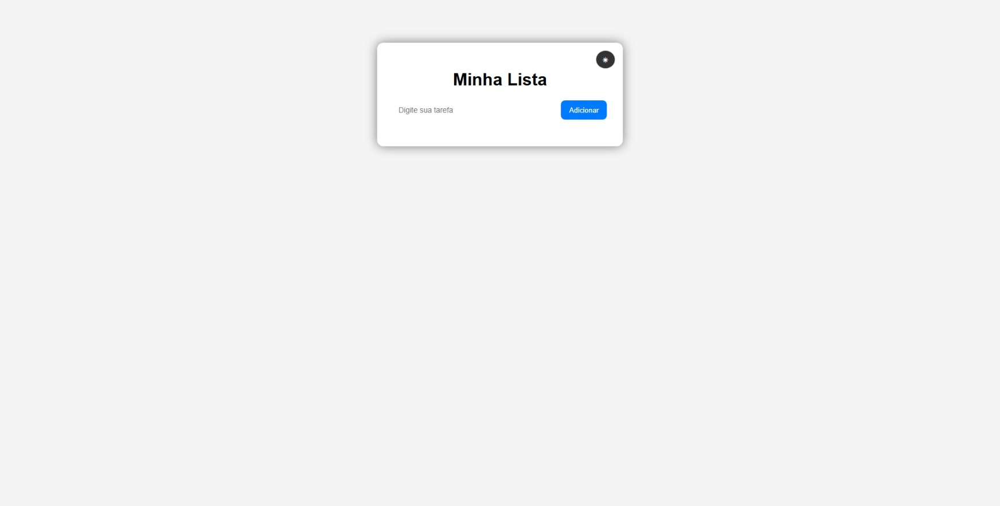

# # 📝 Lista de Tarefas

Aplicação de Lista de Tarefas desenvolvida com HTML, CSS e JavaScript puro, com foco na prática de manipulação de DOM e persistência de dados no navegador.

---

## 🚀 Sobre o Projeto

Este projeto foi desenvolvido com o objetivo de consolidar fundamentos do desenvolvimento web, praticando:

- Manipulação de DOM
- Criação dinâmica de elementos
- Eventos de clique
- Organização de código
- Persistência de dados com LocalStorage

A aplicação permite ao usuário adicionar, concluir e remover tarefas, mantendo os dados salvos mesmo após atualizar ou fechar a página.

---

## ✨ Funcionalidades

✔ Adicionar novas tarefas  
✔ Validação de campo vazio  
✔ Marcar tarefa como concluída  
✔ Ícone visual de confirmação  
✔ Alteração visual ao concluir tarefa  
✔ Remoção de tarefas  
✔ Persistência de dados utilizando a API LocalStorage  
✔ Salvamento automático das tarefas no navegador  

---

## 💻 Tecnologias Utilizadas

- HTML5  
- CSS3  
- JavaScript (Vanilla JS)  
- API LocalStorage  

---

## 🧠 Conceitos Aplicados

- `querySelector` e manipulação de elementos
- `addEventListener`
- `classList.toggle`
- `JSON.stringify()` e `JSON.parse()`
- Armazenamento e recuperação de dados do navegador

---

## 📸 Preview

---

## 🎯 Objetivo

Projeto criado como parte da minha evolução no desenvolvimento web, focando na prática e consolidação dos fundamentos do JavaScript antes de avançar para tecnologias de backend.

---

👨‍💻 Desenvolvido por Bruno Kauã
👨‍💻 Desenvolvido por Bruno Kauã
